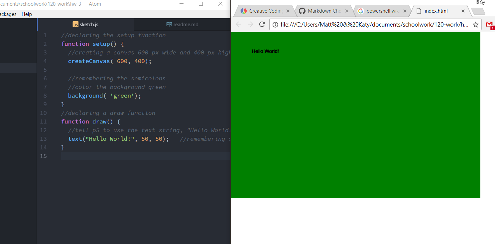

Katy Spence, 50

["Hello World!"](https://katyspence.github.io/120-work/hw-3/)

## Homework, Sept. 28

#### Introduction
This week, I powered through the lessons in just a couple of days because I was really interested and excited about what we're learning.

#### Process
I'm developing a process to working online and making sure that I'm following along and absorbing the material. My process is as follows:
1. Watch the videos in a lesson in one window.
2. Have relevant programs open in another.
3. Use PowerShell to create a text file in a directory, then use PowerShell to add notes into that text file. Basically, I'm taking notes in PowerShell. I feel like this is probably a sacrilegious use of my command line, but it's helping me get more comfortable navigating PowerShell and learn how my machine operates. Plus, it makes taking notes much more interesting.
4. Follow steps along with the video, if possible.
5. Read the notes following the video and open links to external pages.

#### Issues
I'm discovering that my biggest challenge with these lessons and assignments is that I don't have anyone to talk to about them. I feel comfortable with the processes that I'm learning, but I don't know how confident I am using the terminology in real life. It would be nice to spitball ideas with someone and learn how the lingo is used in real life.

I like keeping up with the forums, though. Even though I haven't had many problems, it does help to know that we have our own store of knowledge in which we can help each other. I always read the email notifications when people ask for help, but there haven't been many I feel like I can contribute to. I echoed some sentiments on some posts, but I didn't have anything great to add. I'll keep watching.

I always seem to have a little bit of trouble adding screenshots to these assignments. I thought I figured it out on the last assignment, but I had trouble with this one, too. The image is showing in my preview screen, but it is not showing on my GitHub page.

Plus, I am just excited about what we're learning and have to subject my poor boyfriend to hearing me talk about how cool it is to be learning these things.

*This sounds like a lame issue, but I've been fortunate in set-up and comprehension of the material so far. I'm having a blast!*

#### Triumphs
- **I coded something!**
- **It has a green background!!**
- **It's on the internet!!**
- **_I'm learning formating!_** (that probably shouldn't have double emphasis)
- ~~I'm basically a computer expert.~~ (no, I'm not.)

#### Conclusions
I was worried that my success last week were a fluke, but I'm still feeling comfortable and excited about the material. I'm looking forward to learning more about making visual things, like the interactive video in the p5 Hello World. That was really cool! I'd love to make an interactive map for a website I'm working on, so I'll be looking forward to opportunities like that.

