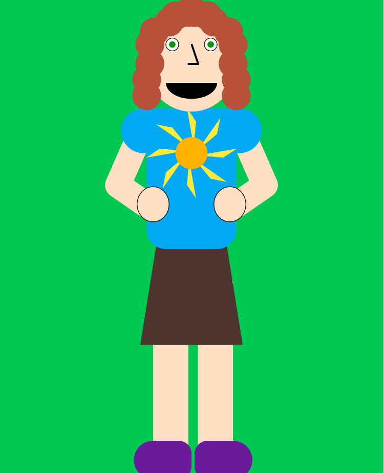

Katy Spence, 50

[Self-Portrait](https://katyspence.github.io/120-work/hw-4/)
# Week 4
Week 4 has been really fun! Tons of new info, which is intimidating, but I feel like I learned so much and didn't have much trouble at all with creating the sketch.

## Process
I've graduated from taking notes in Powershell to taking notes in Atom, which I realize now would have been the smart thing to do from the beginning. I don't regret getting more comfortable in my command line, though.

I typically just take a chunk out of my weekend and grind out the homework. It makes me feel more comfortable knowing I have the rest of the week.

Working on the actual sketch was great! I feel like I could try to know my grid better (I've never been a numbers person), so I'll need to find a different process than just trial and error for future assignments.

## Issues
1. I had an issue finding the JavaScript console on PC/Chrome, but the quick keys CRTL+SHIFT+J open it up.

2. I had to spend a lot of time cleaning up my code after I finished the sketch. I need to be more consistent with my notes and formatting for my sake and your sake.

3. I'm really intimidated by the "mathiness" of some of the things we're starting to learn. I've never been good at math, and I'm getting some flashbacks to geometry. So far, it's okay, so fingers crossed.

## Triumphs
I coded a self-portait! I didn't encounter any huge errors that I didn't understand, and the whole process is very logical to me.

## Conclusion
I'm excited to see what comes next.

