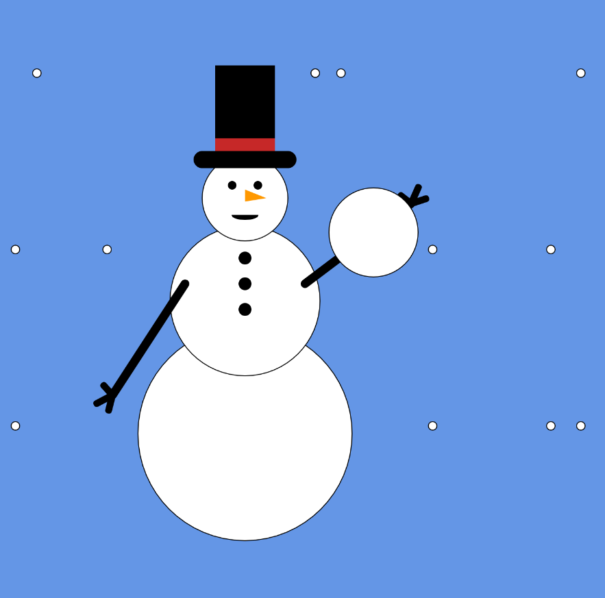

Katy Spence, section 50

["Live Animation Sketch"](

#### Summary
This week, I got intimidated by math and rushed to finish. However, I'm proud of what I accomplished.

#### Process
I had to dive right into this week, taking notes and trying to absord information pretty quickly. Coming up with a concept was the hardest part, and I feel like I'm not a creative as I'd like to be.

#### Issues
I started to feel like my eyes were glazing over each time I saw the word "variable," and that mixed with a heavy workload meant I didn't jump on this week's assignment as quickly as I would have liked to.

I had a hell of a time with the arms, and I realized it's because my code didn't like the updated values to be at the top, but rather following the segment of code, such as Schiffman demonstrated in his circleX example. It was frustrating to figure this out, but it worked in the end.

The snow doesn't look very much like snow, as the rate of falling is totally unnatural. But the snowman sells it.

#### Triumphs
The arms of my snowman move, and it looks like a snowball is coming at the viewer. It feels like a story, which I like.

#### Future
Looking forward to learning more and getting more comfortable with code. I wish there were some smaller guided practices we could do throughout the lessons.

