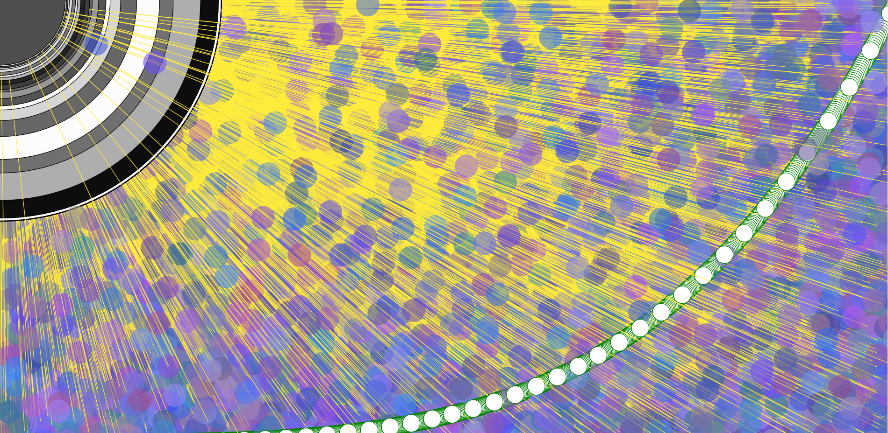

Katy Spence, 50

[Algorithm Sketch](https://katyspence.github.io/120-work/hw-6/)

#### Summary
This week, I learned how to incorporate more complex expressions into coding and create something that can build on itself, with or without user/viewer input.

#### Process
I went through a lot of trial and error this week, but basically my process has been to try a lot of the examples and adapt the ones I like into an image I like.

I had a super-cool rainbow background, but it didn't work with my animation (the new background color kept popping up on top of the other pieces of the animation which were meant to build on each other, so it negated the whole point). I'll find another time to build it in.

#### Issues
I had tons of issues this week.

Some of the math functions are pretty difficult to understand and then visualize. I need to find more examples and just try more things. I think talking about my process out loud could also help.

I also seem to be having some issues with width, height, windowWidth, windowHeight, etc. For some reason, these don't work as expected or desired. It's not something I can explain, but I'd love to come into office hours and try to use them with someone so they can tell me what I'm doing wrong. I'll keep working on it.

The biggest issue, though, is my own imagination. I am having such a hard time coming up with concepts and images to create. For example, I was getting inspiration from another classmate's piece and practicing approaches when I took a break. When I came back to it, I realized I had basically recreated his work. So I scrapped my piece and started over. I think I need to self-assign a theme for each piece to guide the creative direction in addition to the assigned coding required. Maybe I can pick an Inktober theme and run with that.

#### Triumphs
I ended up with a piece I like a lot. It's meant to be viewed full screen to get the marching circles effect. I like the layers the flashing circle can create, and the marching circles that go to their doom (in my mind, at least). I feel comfortable with several of the functions and concepts I used, though there are more I want to keep working on.

#### Future
I need to start working on understanding more complex expressions, such as Prof. Musik used in his smoke sketch. I think rewatching some videos and finding additional examples will help.

